# Exercise 1
| Test Case  | Expected Results   | Actual Results  | Verdict(Pass,Fail,Inconclusive)  |   
|------|------|------|------|
|  1 | accepted  | accepted   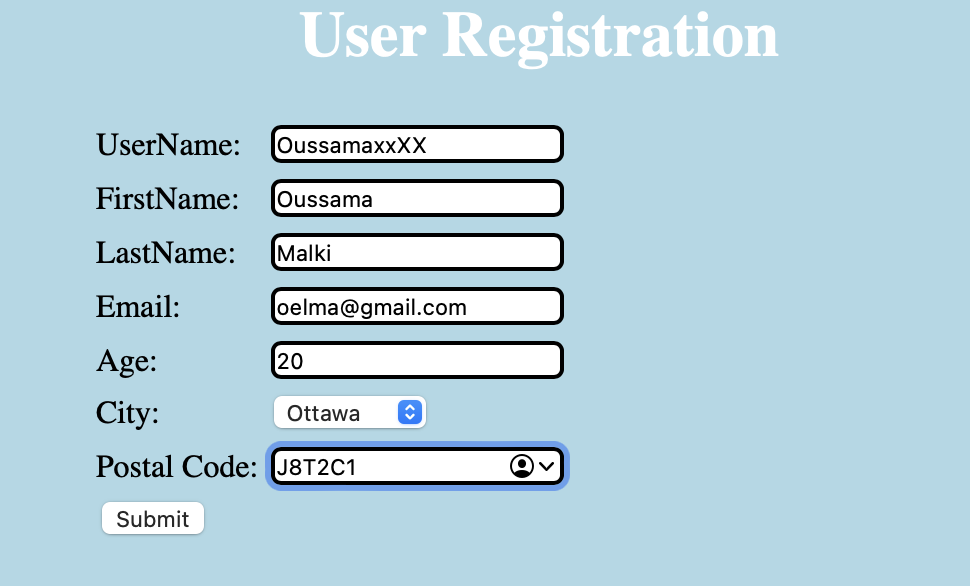   | Pass   |   |
|  2 | accepted  | accepted   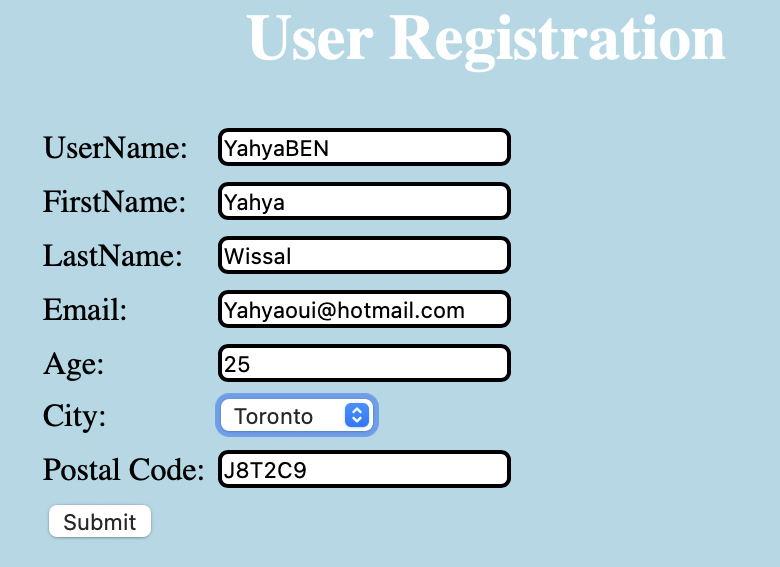   | Pass   |   |
|  3 | accepted  | accepted      | Pass   |   |
|  4 | accepted  | accepted   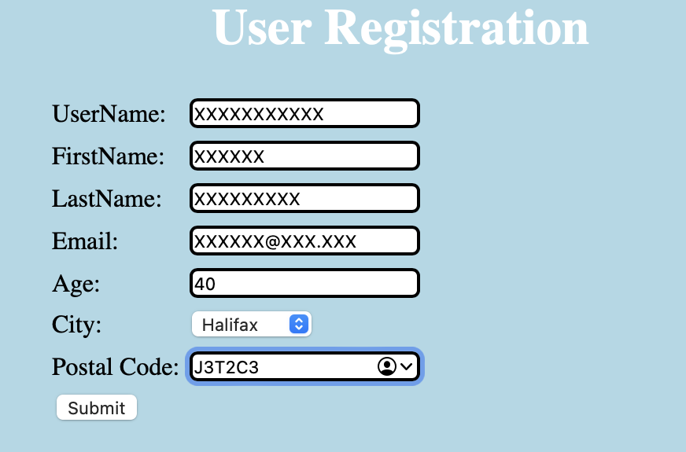   | Pass   |   |
|  5 | Error  | Error   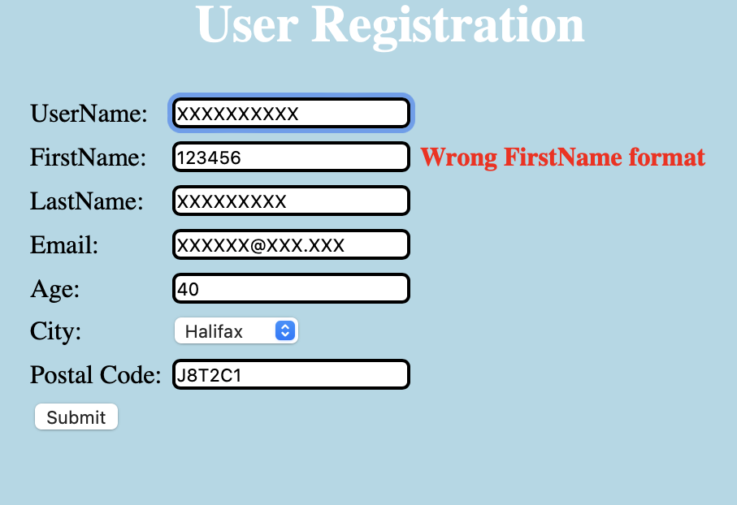   | Fail   |   |
|  6 | Error  | Error   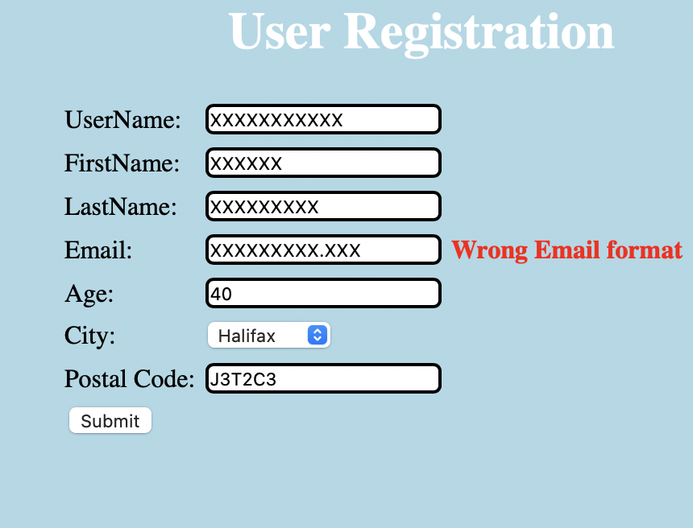   | Fail   |   |
|  7 | Error  | Error   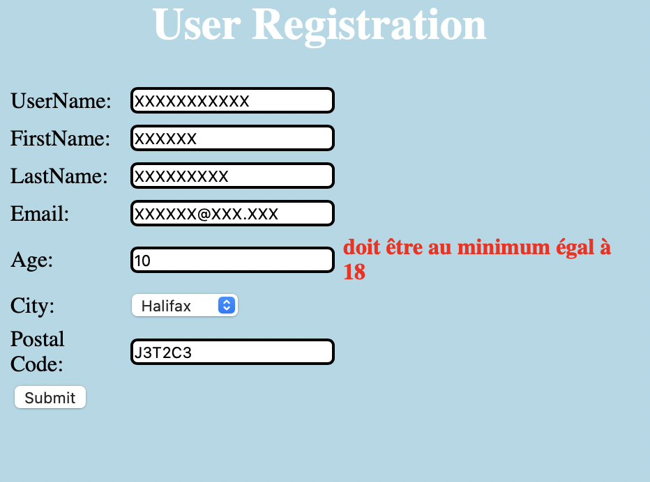   | Fail   |   |
|  8 | Error  | Error   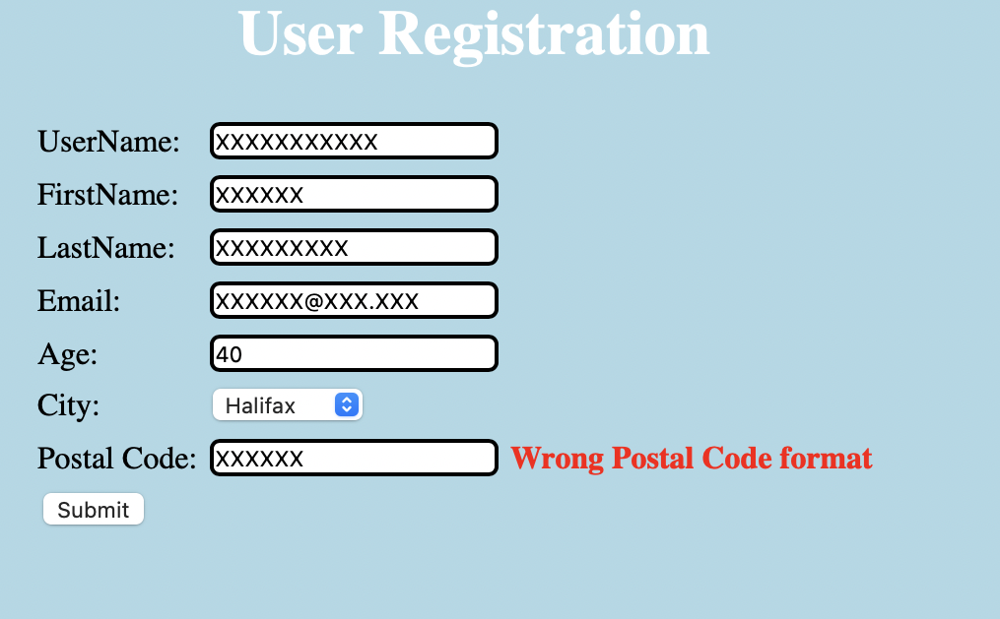   | Fail   |   |
|  9 | Error  | Error   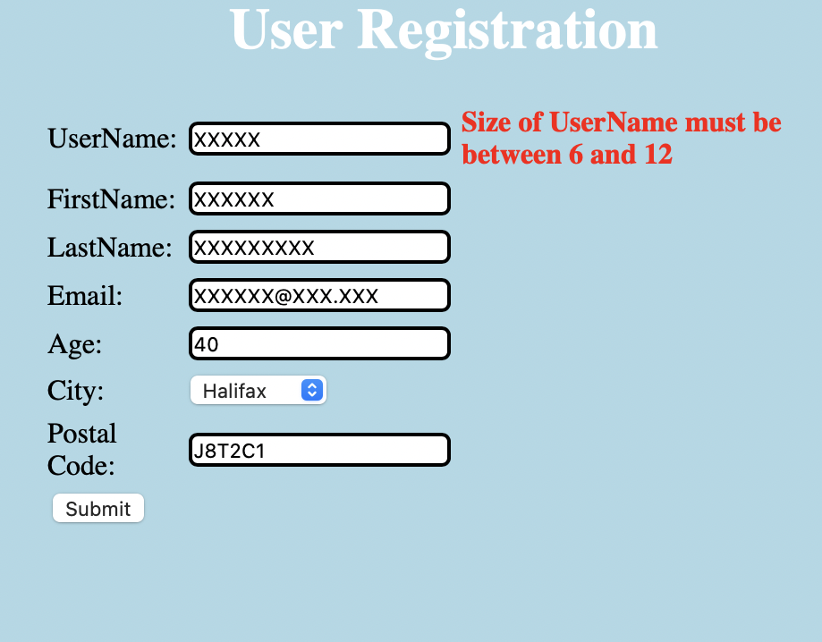   | Fail   |   |

Exercice 2

Test Run using bin/test:
Before writing my tests
   Before writing my tests 
   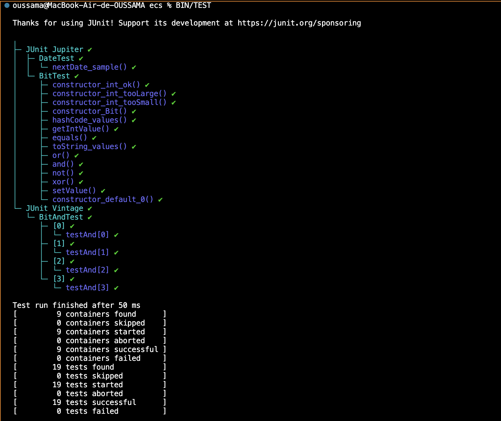  
After adding my tests
   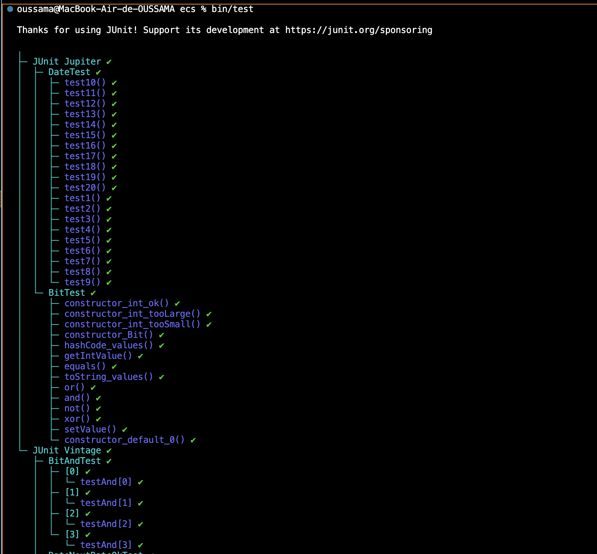  
    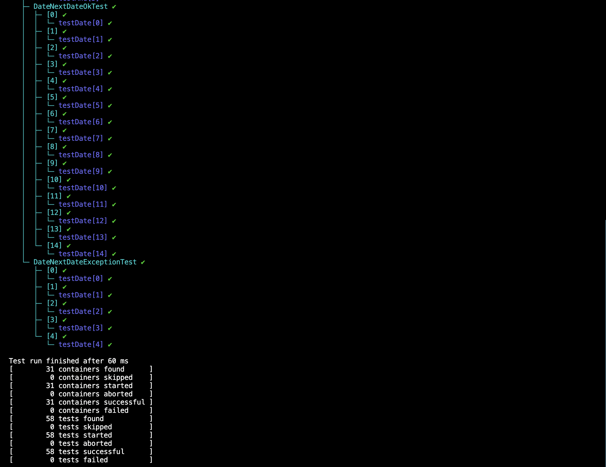  
Typical explicit test case that doesn't use exceptions:
   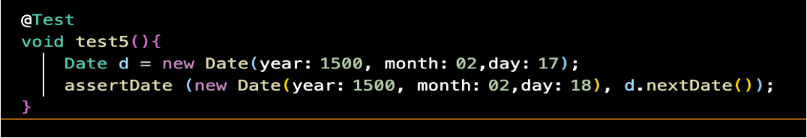  
Explicit test cases that have exceptions:
    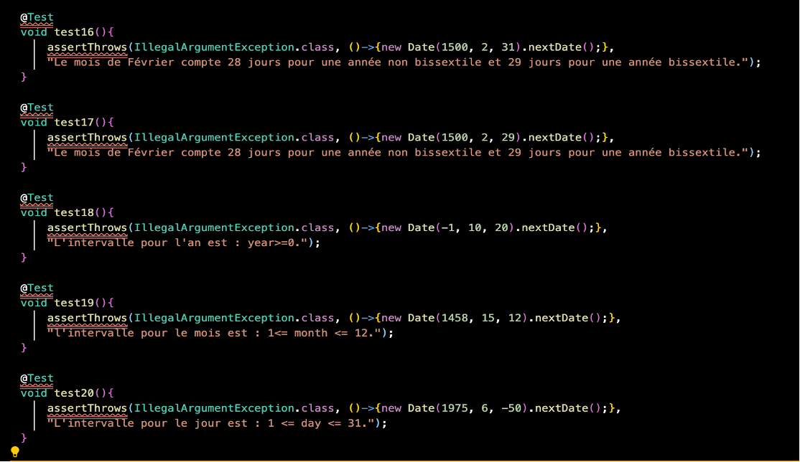  
Parameterized test values for test cases that run OK and return a Date.
   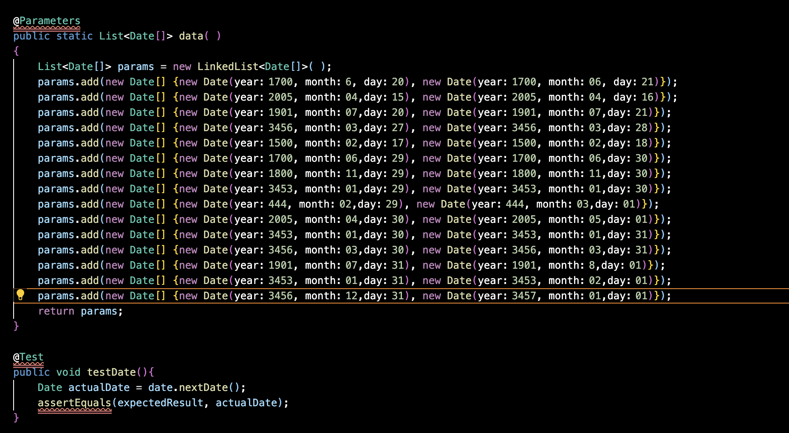  
Parameterized test values for tests cases that DO result in an exception.
   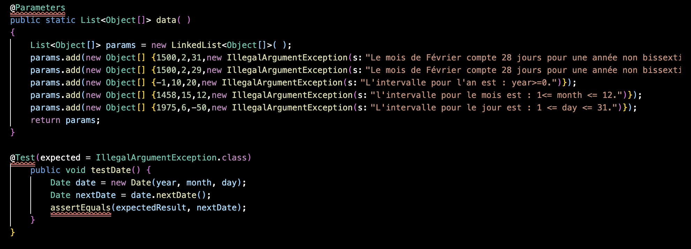  

