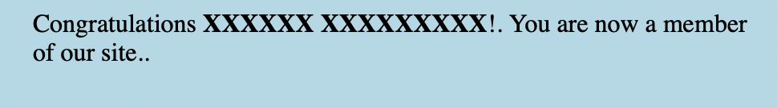

# Exercise 1
| Test Case  | Expected Results   | Actual Results  | Verdict(Pass,Fail,Inconclusive)  |   
|------|------|------|------|
|  1 | accepted  | accepted      | Pass   |   |
|  2 | accepted  | accepted      | Pass   |   |
|  3 | accepted  | accepted      | Pass   |   |
|  4 | accepted  | accepted      | Pass   |   |
|  5 | Error  | accepted      | Fail   |   |
|  6 | Error  | accepted      | Fail   |   |
|  7 | Error  | accepted      | Fail   |   |
|  8 | Error  | accepted      | Fail   |   |
|  9 | Error  | accepted      | Fail   |   |