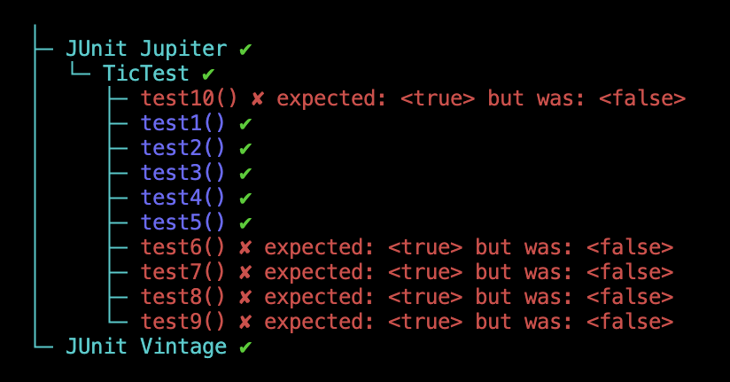
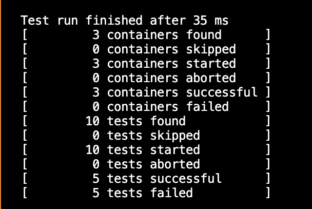
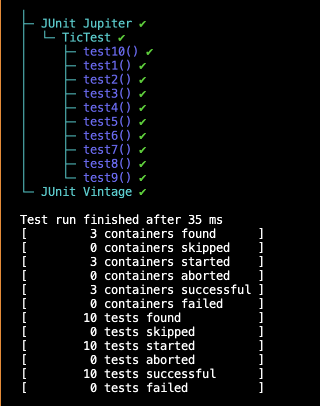

 For my part, My tests are used to make sure that the function is empty actually works, the first commit shows that all my test failed and then i commited the second time to show that all test passed 

 Test failing 
     
     

   Test passing 
      