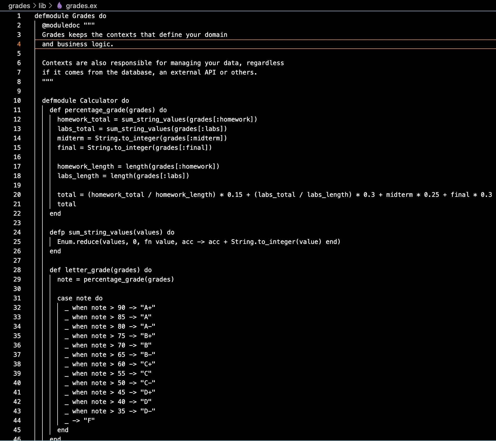
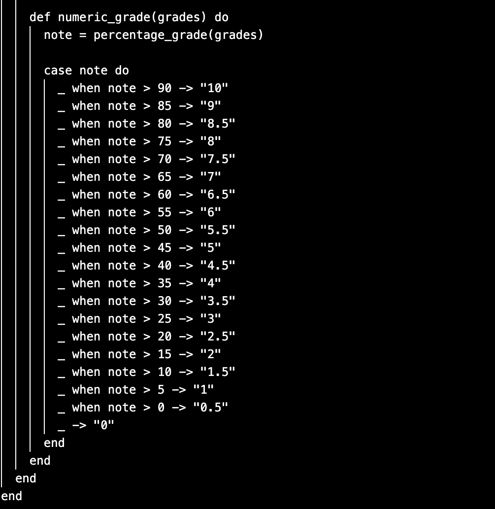
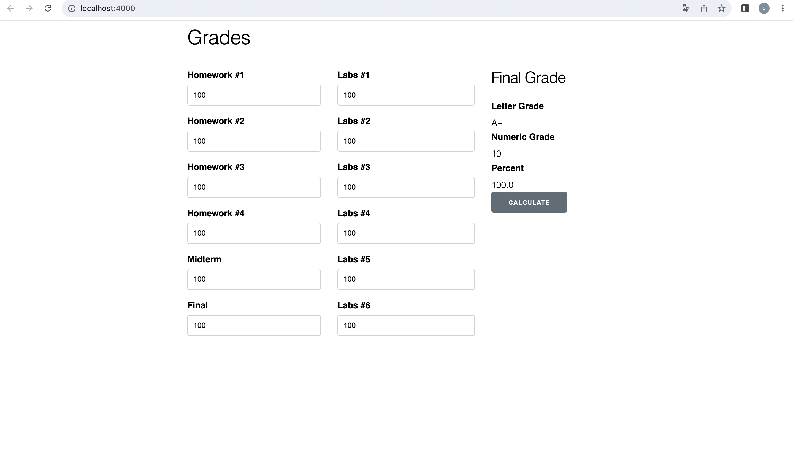

Grades : 
STUBBED CODE
     
     
Dans cette partie, nous avons créé des stubs dans le but de définir la signature des méthodes qui sont connectées au reste du système. Ces méthodes sont présentes pour calculer la note finale en se basant sur les coefficiants suivants :
(homework_total / homework_length) * 0.15 + (labs_total / labs_length) * 0.3 + midterm * 0.25 + final * 0.3 et affiche ensuite percentage_grade, letter_grade et numeric_grade
OUTPUT ON THE WEBPAGE WITH THE STUBBED CODE 
      
Avec le code stubbed, nous pouvons constater que l'application web est capable d'afficher nos notes renvoyées comme prévu. Cela signifie que la partie backend de notre application web se connecte efficacement avec la partie frontend.
Twitter :
4 Missing Tests :
     
     
Il y a deux erreurs dans deux Tests. Dans la classe Twitter.java, la méthode loadTweet() présente trois résultats possibles. Elle peut retourner la chaîne de caractères "I am tweet that likes to talk about @me", la chaîne de caractères "Hello to @you", ou bien null.
     
Les tests isMentionned_handleNull() et isMentionned_dontReturnSubstringMatches() ont échoué. Cependant, dans la méthode isMentionned(), la possibilité que le tweet soit null ou que le nom soit une sous-chaîne n'a pas été prise en compte. Nous avons donc mis à jour la méthode isMentionned.
     
Résultats Après isMentionned est mis à jour :
     

