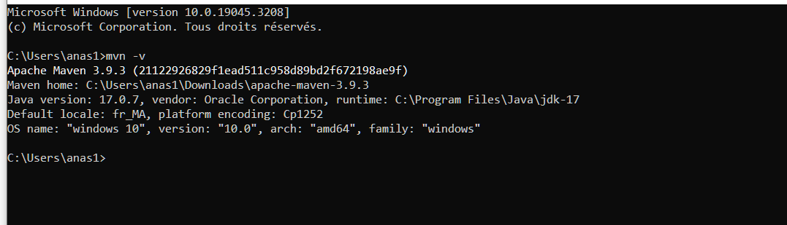
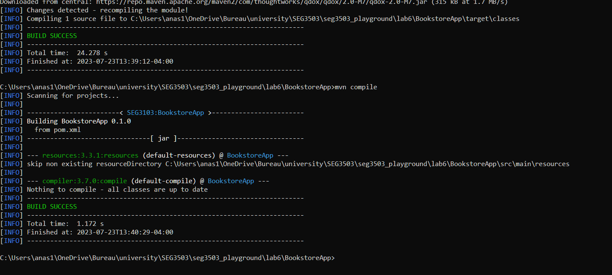
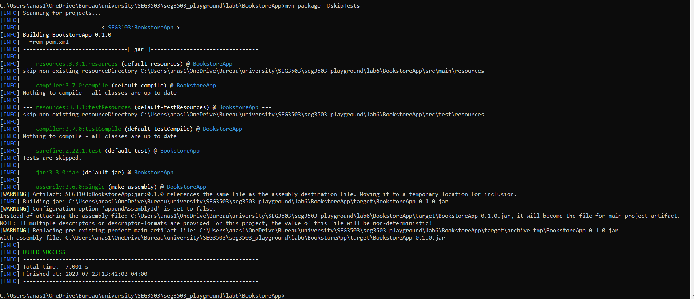
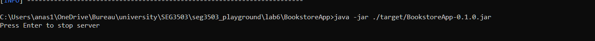
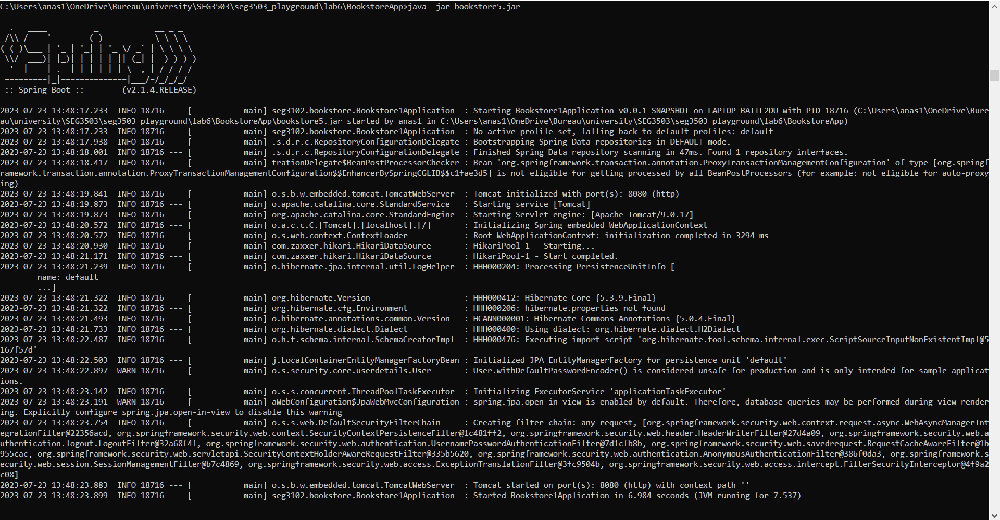
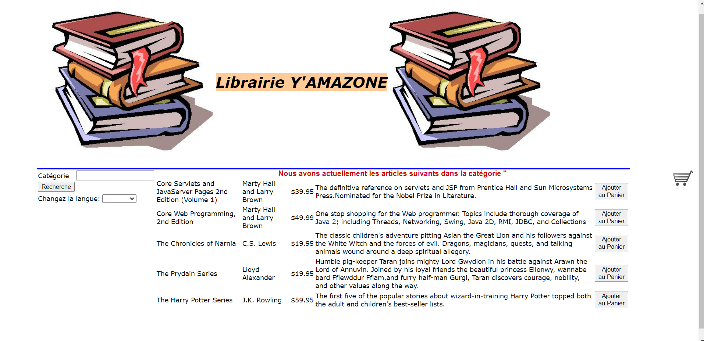
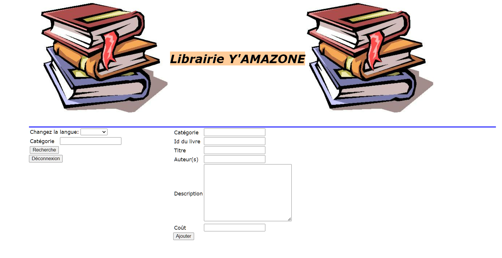
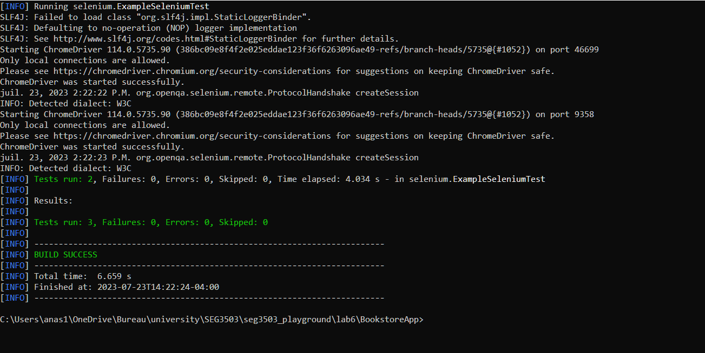
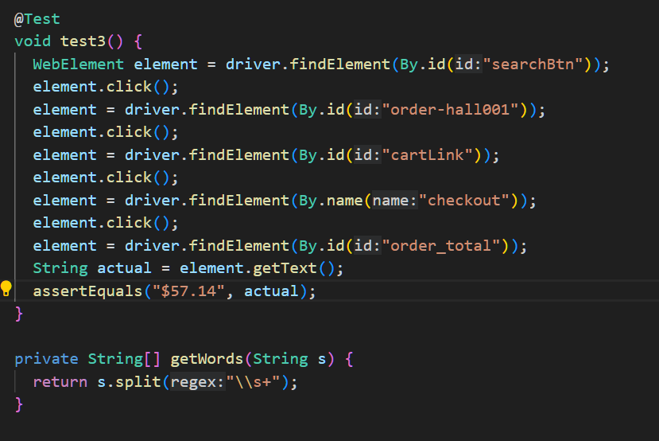
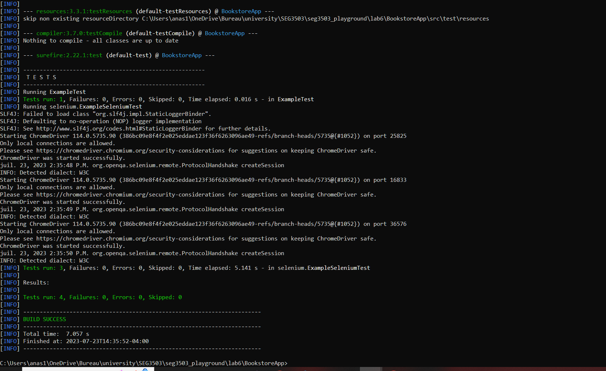

output of mvn -v
    
output of mvn compile
    
output of mvn package -DskipTests
    
output of java -jar ./target/BookstoreApp-0.1.0.jar
    
output of java -jar bookstore5.jar
    
website images :
    
    
test before:
    
test 3:
    
test after:
    