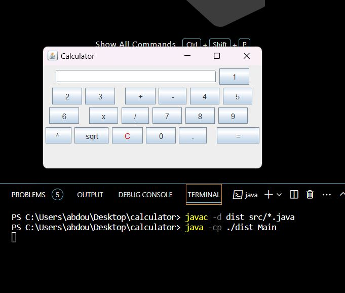
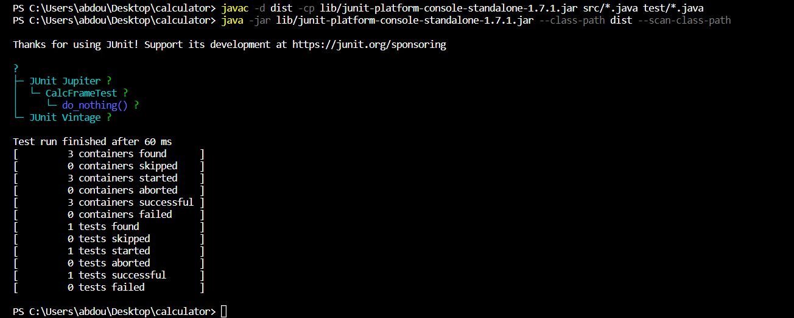
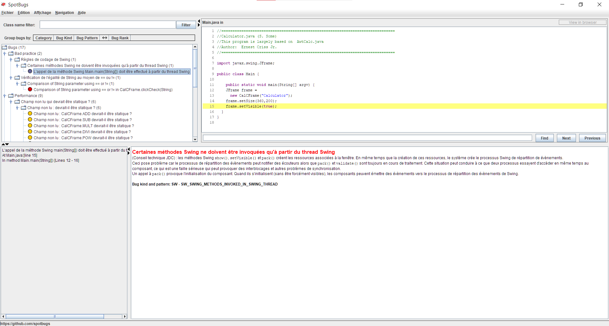
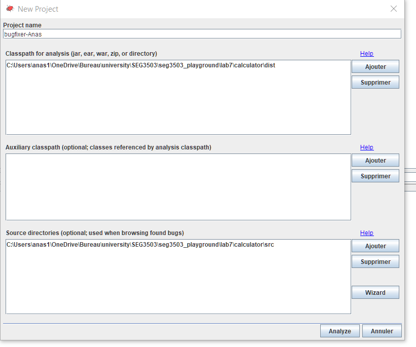
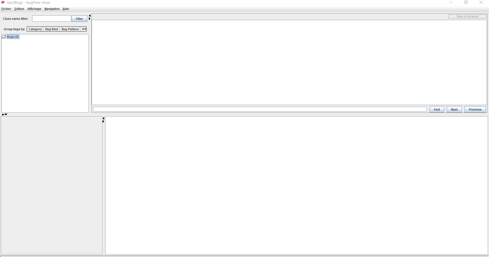

    
    
### Spotage de bugs
    
    
BAD PRACTICE 
1.Certaines méthodes Swing ne doivent être invoquées qu'à partir du thread Swing 
2.Comparison of String parameter using == or != 
PERFORMANCE 
1.Peut-être transformée en classe interne statique nommée 
2.Boxing/unboxing to parse a primitive 
3.Boxing/unboxing to parse a primitiv 
4.Champ non lu : devrait-il être statique ? 
5.Champ non lu : devrait-il être statique ? 
6.Champ non lu : devrait-il être statique ? 
7.Champ non lu : devrait-il être statique ? 
8.Champ non lu : devrait-il être statique ? 
9.Champ non lu : devrait-il être statique ? 
DODGY CODE 
1.Méthode utilisant le même code pour deux branches 
2.Switch statement found where default case is missing 
3.Condition has no effect 
4.Condition has no effect 
5.Condition has no effect 
6.Condition has no effect 
### correction de bugs
Before:  
if ( s == "" )  
    After:  
if (s.isEmpty()) 
  
Before:  
setVisible(true); //in Main.java 
    
 After: 
public CalCFrame(String title) { 

  super(title); 
  setVisible(true); //in CalCFrame.java 
  //... 
    Before: 
addWindowListener(new WindowAdapter() { 
  public void windowClosing(WindowEvent e) { 
  System.exit(0); 
}}); 
    After: 
private static class CustomWindowAdapter extends WindowAdapter { 
  public void windowClosing(WindowEvent e) { 
    System.exit(0); 
  } 
} 
//... 
addWindowListener(new CustomWindowAdapter()); 
    Before: 
num1 = Double.valueOf( input ).doubleValue(); 
    After: 
num1 = Double.parseDouble(input); 
    Before: 
answer = Double.valueOf(s).doubleValue(); 
    After: 
answer = Double.parseDouble(s); 
    Before: 
num2 = Double.valueOf( input ).doubleValue(); 
    After: 
num2 = Double.parseDouble(input); 
    Before: 
num3 = Double.valueOf( input ).doubleValue(); 
    After: 
num3 = Double.parseDouble(input); 
    Before: 
private final int ADD=1,     
  SUB = 2,      
  MULT = 3,  
  DIVI = 4,  
  POW = 5,  
  SQRT = 6; 
    After: 
private static final int ADD=1,        
  SUB = 2,      
  MULT = 3,  
  DIVI = 4,  
  POW = 5,  
  SQRT = 6; 
    Before: 
if ( i <= 2 ) 
  getContentPane().add( buttons[i] ); 
else if ( i >= 3 && i <= 7) 
  getContentPane().add( buttons[i] ); 
else if ( i >=8 && i <= 12 ) 
  getContentPane().add( buttons[i] ); 
else if ( i >= 13 && i <= 17 ) 
   getContentPane().add( buttons[i] ); 
else 
  getContentPane().add( buttons[i] ); 
getContentPane().add( buttons[i] ); 
    Before: 
switch( oper ) { 
  // ... 
  // no default case 
} 
} 
    After: 
switch( oper ) { 
  // ... 
  default:  
    clearScreen(); 
    System.out.println("Calculate called without operator -> investigate!"); 
    break; 
} 
    Before: 
else if (morenums) { 
    After: 
else { 

    

